# MegaWords V3.5 UML状态图 + 数据库ER图

> 版本：V3.5（2026-06-26，45表全量对齐实际代码）
> 所有图表采用 Mermaid 标准语法

---

## 一、核心业务UML状态图

### 1.1 会员状态流转图

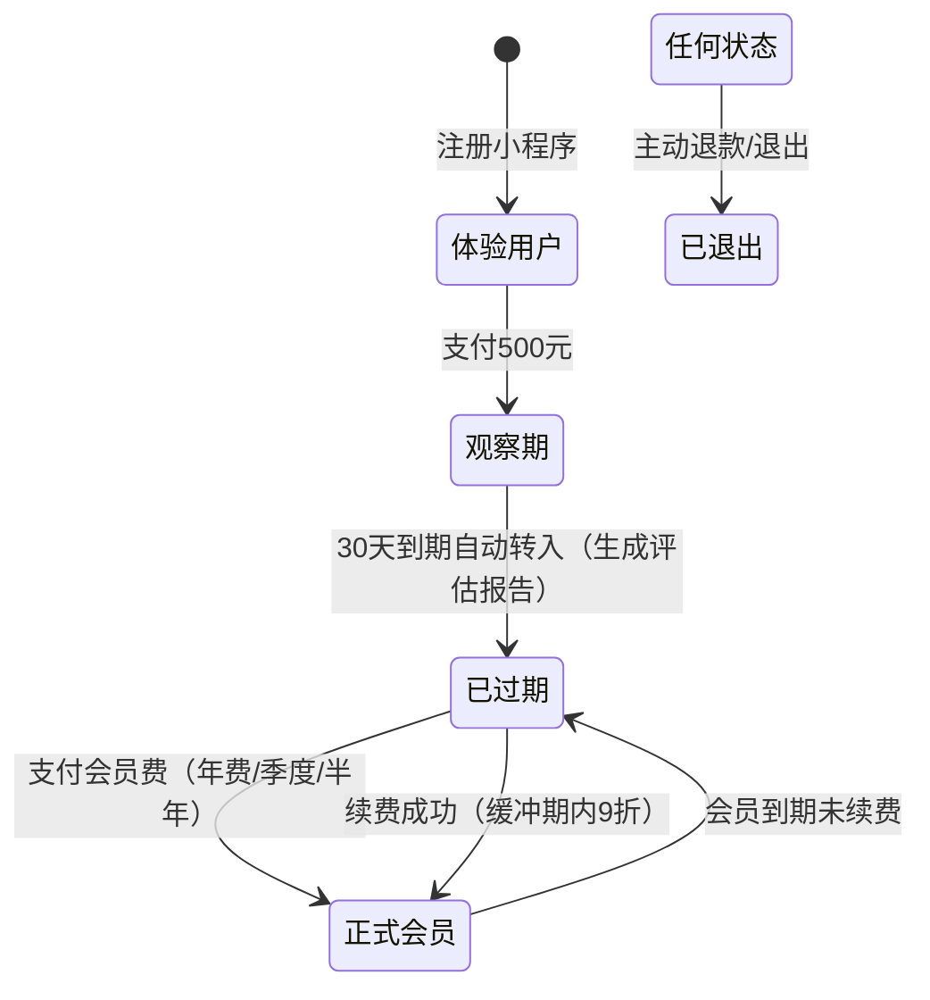
```mermaid
stateDiagram-v2
    [*] --> 体验用户 : 注册小程序
    体验用户 --> 观察期 : 支付500元
    观察期 --> 已过期 : 30天到期自动转入（生成评估报告）
    已过期 --> 正式会员 : 支付会员费（年费/季度/半年）
    正式会员 --> 已过期 : 会员到期未续费
    已过期 --> 正式会员 : 续费成功（缓冲期内9折）
    任何状态 --> 已退出 : 主动退款/退出
```

代码常量（`child.status`）：0=体验用户 1=观察期 2=正式会员 3=已过期 4=已退出

注：
- 观察期到期后自动转为 EXPIRED(3)（由定时任务 `check_observation_expiry` 每日 9:30 执行）
- EXPIRED 用户可续费任何会员类型恢复为 OFFICIAL(2)，缓冲期内享 9 折（`renewal_discount` 配置）
- 季度/半年会员复用 OFFICIAL(2) 状态，通过 `Order.type` 字段区分（QUARTERLY=4, SEMI_ANNUAL=5）
- 退款前必须无活跃借阅记录（BORROWING/OVERDUE），否则拒绝退款

### 1.2 订单状态流转图

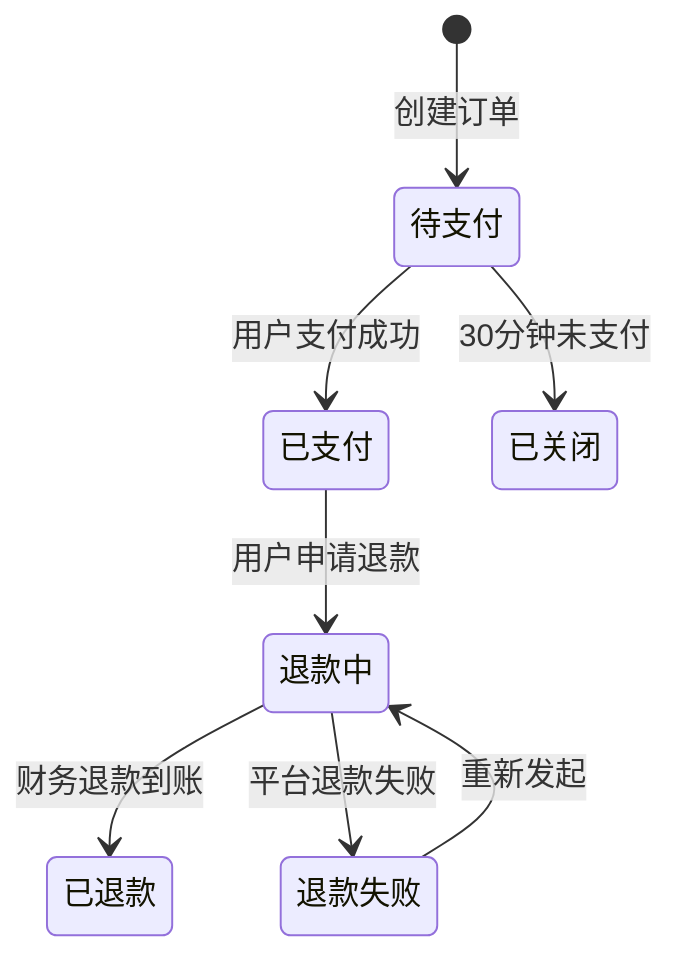
```mermaid
stateDiagram-v2
    [*] --> 待支付 : 创建订单
    待支付 --> 已支付 : 用户支付成功
    待支付 --> 已关闭 : 30分钟未支付
    已支付 --> 退款中 : 用户申请退款
    退款中 --> 已退款 : 财务退款到账
    退款中 --> 退款失败 : 平台退款失败
    退款失败 --> 退款中 : 重新发起
```

代码常量（`order.pay_status`）：0=待支付 1=已支付 2=支付失败 3=退款中 4=已退款 5=已关闭

### 1.3 晋级流转图

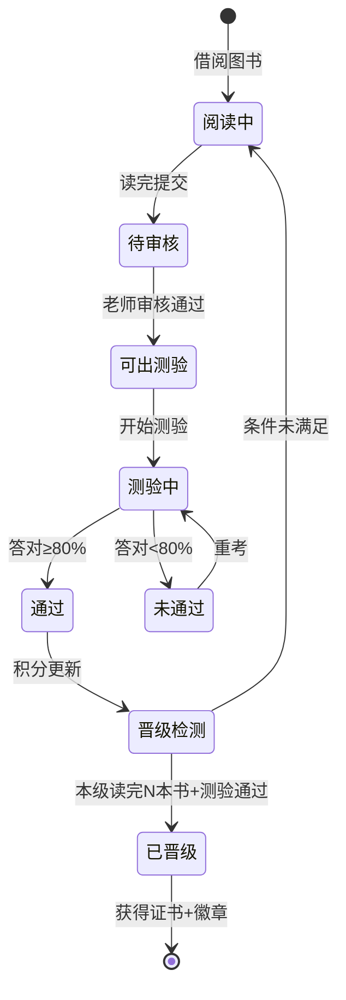
```mermaid
stateDiagram-v2
    [*] --> 阅读中 : 借阅图书
    阅读中 --> 待审核 : 读完提交
    待审核 --> 可出测验 : 老师审核通过
    可出测验 --> 测验中 : 开始测验
    测验中 --> 通过 : 答对≥80%
    测验中 --> 未通过 : 答对<80%
    未通过 --> 测验中 : 重考
    通过 --> 晋级检测 : 积分更新
    晋级检测 --> 已晋级 : 本级读完N本书+测验通过
    晋级检测 --> 阅读中 : 条件未满足
    已晋级 --> [*] : 获得证书+徽章
```

### 1.4 活动报名状态流转图

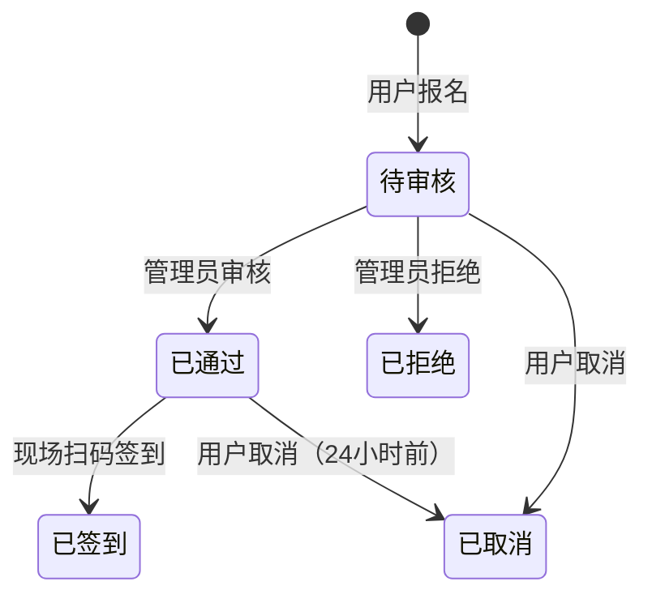
```mermaid
stateDiagram-v2
    [*] --> 待审核 : 用户报名
    待审核 --> 已通过 : 管理员审核
    待审核 --> 已拒绝 : 管理员拒绝
    已通过 --> 已签到 : 现场扫码签到
    已通过 --> 已取消 : 用户取消（24小时前）
    待审核 --> 已取消 : 用户取消
```

代码常量（`activity_enrollment.status`）：0=待审核 1=已通过 2=已拒绝 3=已取消 4=已签到

### 1.5 退款申请状态流转图

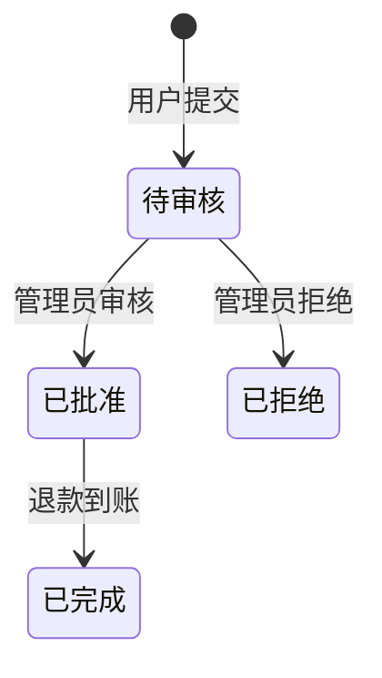
```mermaid
stateDiagram-v2
    [*] --> 待审核 : 用户提交
    待审核 --> 已批准 : 管理员审核
    待审核 --> 已拒绝 : 管理员拒绝
    已批准 --> 已完成 : 退款到账
```

代码常量（`refund_application.status`）：0=待审核 1=已批准 2=已拒绝 3=已完成

### 1.6 借阅记录状态流转图 ★ V3.5

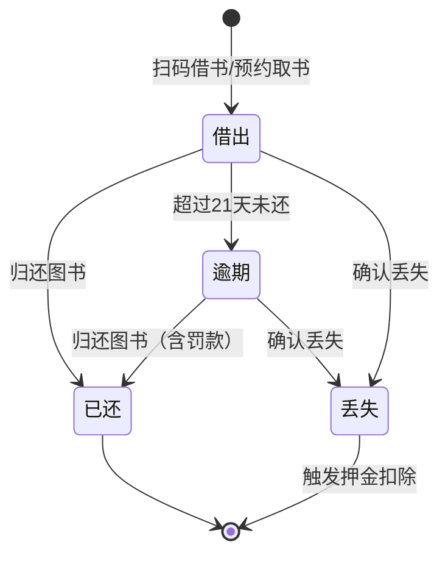
```mermaid
stateDiagram-v2
    [*] --> 借出 : 扫码借书/预约取书
    借出 --> 已还 : 归还图书
    借出 --> 逾期 : 超过21天未还
    逾期 --> 已还 : 归还图书（含罚款）
    借出 --> 丢失 : 确认丢失
    逾期 --> 丢失 : 确认丢失
    已还 --> [*]
    丢失 --> [*] : 触发押金扣除
```

代码常量（`borrow_record.status`）：0=借出 1=已还 2=逾期 3=丢失

### 1.7 押金记录状态流转图 ★ V3.5

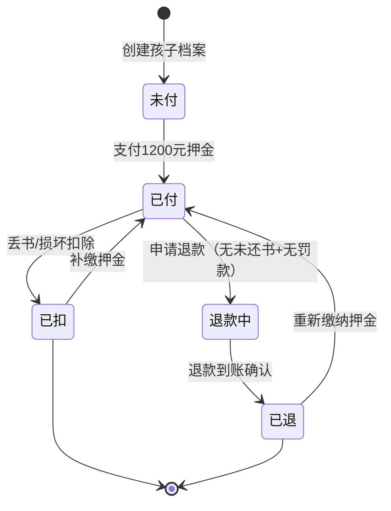
```mermaid
stateDiagram-v2
    [*] --> 未付 : 创建孩子档案
    未付 --> 已付 : 支付1200元押金
    已付 --> 退款中 : 申请退款（无未还书+无罚款）
    退款中 --> 已退 : 退款到账确认
    已付 --> 已扣 : 丢书/损坏扣除
    已扣 --> 已付 : 补缴押金
    已退 --> 已付 : 重新缴纳押金
    已扣 --> [*]
    已退 --> [*]
```

代码常量（`deposit_record.status`）：0=未付 1=已付 2=已退 3=已扣 4=退款中

### 1.8 预约取书状态流转图 ★ V3.5

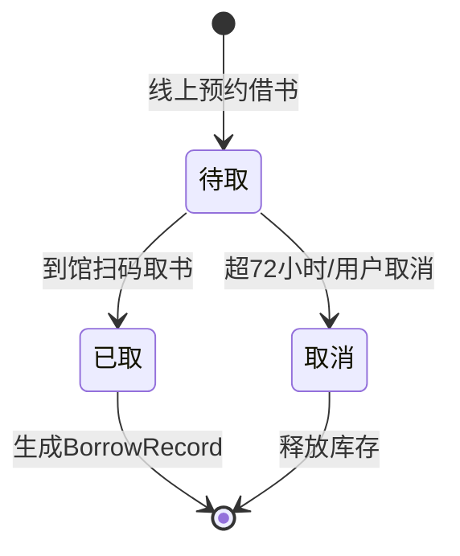
```mermaid
stateDiagram-v2
    [*] --> 待取 : 线上预约借书
    待取 --> 已取 : 到馆扫码取书
    待取 --> 取消 : 超72小时/用户取消
    已取 --> [*] : 生成BorrowRecord
    取消 --> [*] : 释放库存
```

代码常量（`reservation.status`）：0=待取 1=已备 2=已取 3=取消

---

## 二、数据库ER图

### 2.1 用户与孩子模块

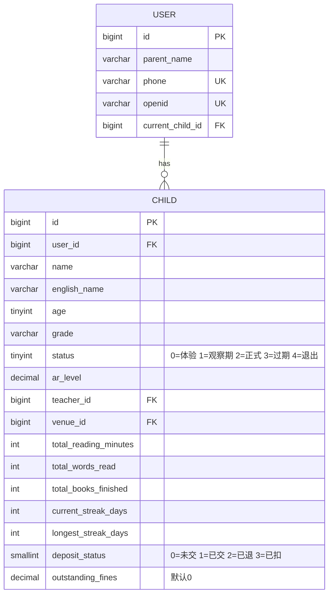
```mermaid
erDiagram
    USER {
        bigint id PK
        varchar parent_name
        varchar phone UK
        varchar openid UK
        bigint current_child_id FK
    }

    CHILD {
        bigint id PK
        bigint user_id FK
        varchar name
        varchar english_name
        tinyint age
        varchar grade
        tinyint status "0=体验 1=观察期 2=正式 3=过期 4=退出"
        decimal ar_level
        bigint teacher_id FK
        bigint venue_id FK
        int total_reading_minutes
        int total_words_read
        int total_books_finished
        int current_streak_days
        int longest_streak_days
        smallint deposit_status "0=未交 1=已交 2=已退 3=已扣"
        decimal outstanding_fines "默认0"
    }

    USER ||--o{ CHILD : "has"
```

### 2.2 场馆与老师

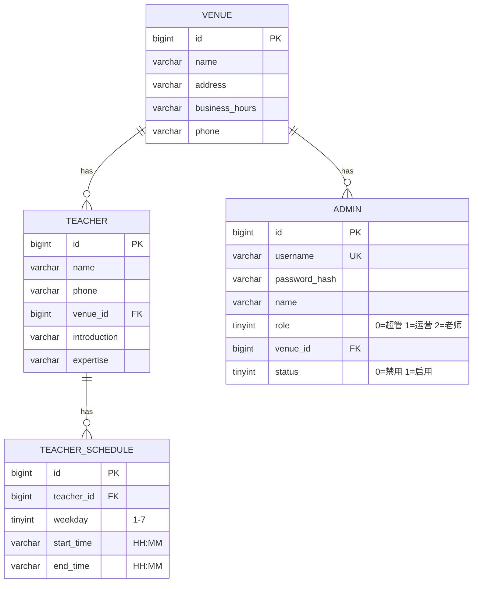
```mermaid
erDiagram
    VENUE {
        bigint id PK
        varchar name
        varchar address
        varchar business_hours
        varchar phone
    }

    TEACHER {
        bigint id PK
        varchar name
        varchar phone
        bigint venue_id FK
        varchar introduction
        varchar expertise
    }

    TEACHER_SCHEDULE {
        bigint id PK
        bigint teacher_id FK
        tinyint weekday "1-7"
        varchar start_time "HH:MM"
        varchar end_time "HH:MM"
    }

    ADMIN {
        bigint id PK
        varchar username UK
        varchar password_hash
        varchar name
        tinyint role "0=超管 1=运营 2=老师"
        bigint venue_id FK
        tinyint status "0=禁用 1=启用"
    }

    VENUE ||--o{ TEACHER : "has"
    TEACHER ||--o{ TEACHER_SCHEDULE : "has"
    VENUE ||--o{ ADMIN : "has"
```

### 2.3 图书模块

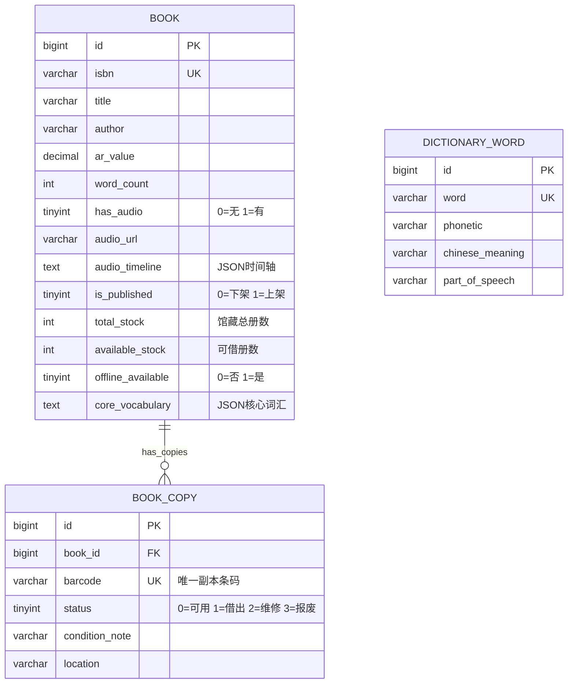
```mermaid
erDiagram
    BOOK {
        bigint id PK
        varchar isbn UK
        varchar title
        varchar author
        decimal ar_value
        int word_count
        tinyint has_audio "0=无 1=有"
        varchar audio_url
        text audio_timeline "JSON时间轴"
        tinyint is_published "0=下架 1=上架"
        int total_stock "馆藏总册数"
        int available_stock "可借册数"
        tinyint offline_available "0=否 1=是"
        text core_vocabulary "JSON核心词汇"
    }

    BOOK_COPY {
        bigint id PK
        bigint book_id FK
        varchar barcode UK "唯一副本条码"
        tinyint status "0=可用 1=借出 2=维修 3=报废"
        varchar condition_note
        varchar location
    }

    DICTIONARY_WORD {
        bigint id PK
        varchar word UK
        varchar phonetic
        varchar chinese_meaning
        varchar part_of_speech
    }

    BOOK ||--o{ BOOK_COPY : "has_copies"
```

### 2.4 书架与收藏夹

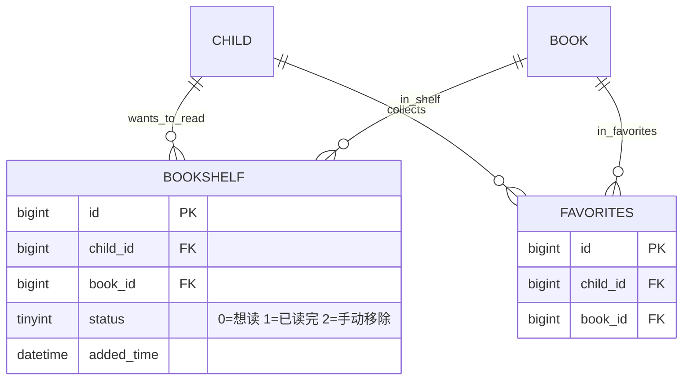
```mermaid
erDiagram
    BOOKSHELF {
        bigint id PK
        bigint child_id FK
        bigint book_id FK
        tinyint status "0=想读 1=已读完 2=手动移除"
        datetime added_time
    }

    FAVORITES {
        bigint id PK
        bigint child_id FK
        bigint book_id FK
    }

    CHILD ||--o{ BOOKSHELF : "wants_to_read"
    CHILD ||--o{ FAVORITES : "collects"
    BOOK ||--o{ BOOKSHELF : "in_shelf"
    BOOK ||--o{ FAVORITES : "in_favorites"
```

### 2.5 借阅与预约模块 ★ V3.1

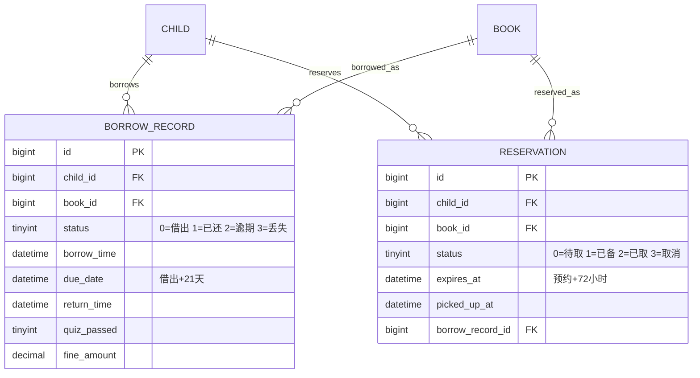
```mermaid
erDiagram
    BORROW_RECORD {
        bigint id PK
        bigint child_id FK
        bigint book_id FK
        tinyint status "0=借出 1=已还 2=逾期 3=丢失"
        datetime borrow_time
        datetime due_date "借出+21天"
        datetime return_time
        tinyint quiz_passed
        decimal fine_amount
    }

    RESERVATION {
        bigint id PK
        bigint child_id FK
        bigint book_id FK
        tinyint status "0=待取 1=已备 2=已取 3=取消"
        datetime expires_at "预约+72小时"
        datetime picked_up_at
        bigint borrow_record_id FK
    }

    CHILD ||--o{ BORROW_RECORD : "borrows"
    CHILD ||--o{ RESERVATION : "reserves"
    BOOK ||--o{ BORROW_RECORD : "borrowed_as"
    BOOK ||--o{ RESERVATION : "reserved_as"
```

### 2.6 押金模块 ★ V3.1

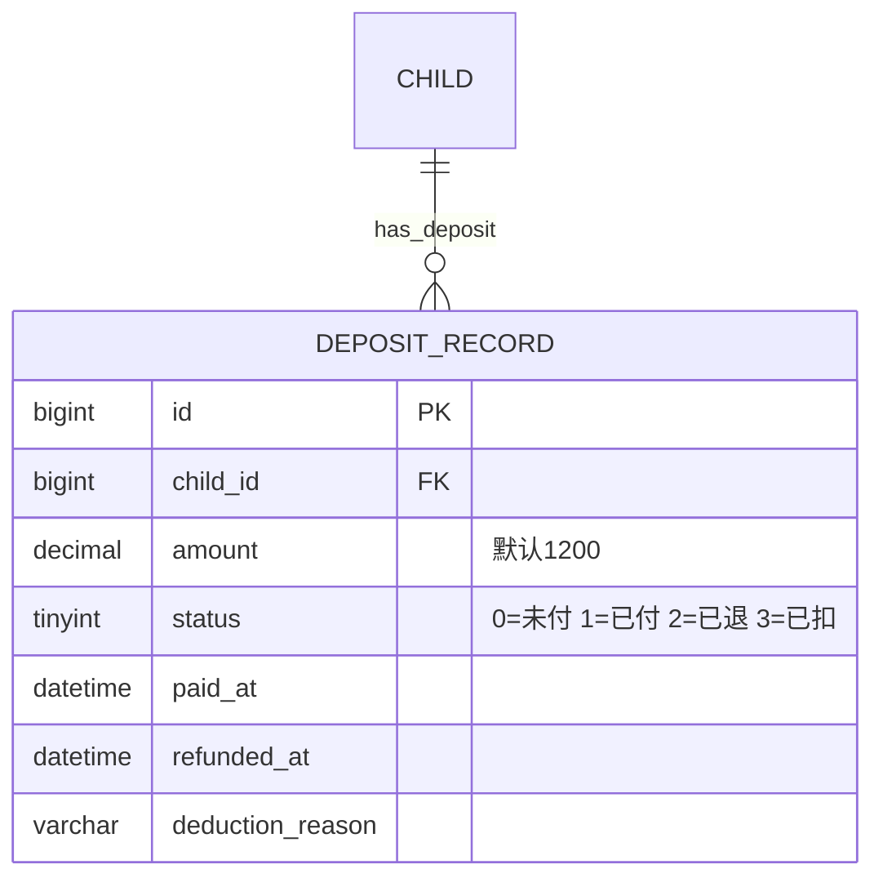
```mermaid
erDiagram
    DEPOSIT_RECORD {
        bigint id PK
        bigint child_id FK
        decimal amount "默认1200"
        tinyint status "0=未付 1=已付 2=已退 3=已扣"
        datetime paid_at
        datetime refunded_at
        varchar deduction_reason
    }

    CHILD ||--o{ DEPOSIT_RECORD : "has_deposit"
```

### 2.7 阅读行为模块

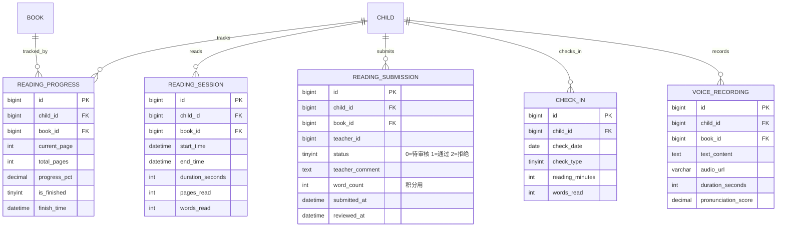
```mermaid
erDiagram
    READING_PROGRESS {
        bigint id PK
        bigint child_id FK
        bigint book_id FK
        int current_page
        int total_pages
        decimal progress_pct
        tinyint is_finished
        datetime finish_time
    }

    READING_SESSION {
        bigint id PK
        bigint child_id FK
        bigint book_id FK
        datetime start_time
        datetime end_time
        int duration_seconds
        int pages_read
        int words_read
    }

    READING_SUBMISSION {
        bigint id PK
        bigint child_id FK
        bigint book_id FK
        bigint teacher_id
        tinyint status "0=待审核 1=通过 2=拒绝"
        text teacher_comment
        int word_count "积分用"
        datetime submitted_at
        datetime reviewed_at
    }

    CHECK_IN {
        bigint id PK
        bigint child_id FK
        date check_date
        tinyint check_type
        int reading_minutes
        int words_read
    }

    VOICE_RECORDING {
        bigint id PK
        bigint child_id FK
        bigint book_id FK
        text text_content
        varchar audio_url
        int duration_seconds
        decimal pronunciation_score
    }

    CHILD ||--o{ READING_PROGRESS : "tracks"
    CHILD ||--o{ READING_SESSION : "reads"
    CHILD ||--o{ READING_SUBMISSION : "submits"
    CHILD ||--o{ CHECK_IN : "checks_in"
    CHILD ||--o{ VOICE_RECORDING : "records"
    BOOK ||--o{ READING_PROGRESS : "tracked_by"
```

### 2.8 词汇模块

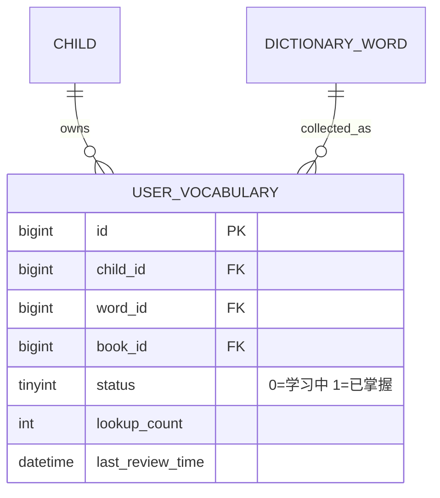
```mermaid
erDiagram
    USER_VOCABULARY {
        bigint id PK
        bigint child_id FK
        bigint word_id FK
        bigint book_id FK
        tinyint status "0=学习中 1=已掌握"
        int lookup_count
        datetime last_review_time
    }

    CHILD ||--o{ USER_VOCABULARY : "owns"
    DICTIONARY_WORD ||--o{ USER_VOCABULARY : "collected_as"
```

### 2.9 晋级体系模块

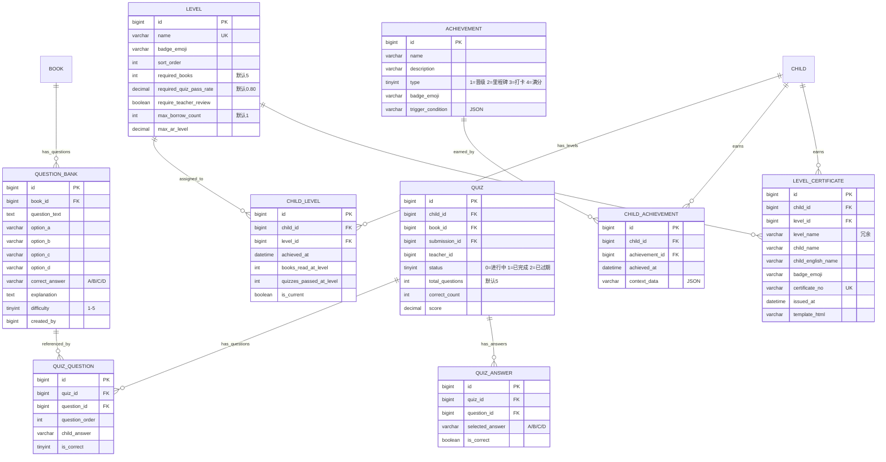
```mermaid
erDiagram
    LEVEL {
        bigint id PK
        varchar name UK
        varchar badge_emoji
        int sort_order
        int required_books "默认5"
        decimal required_quiz_pass_rate "默认0.80"
        boolean require_teacher_review
        int max_borrow_count "默认1"
        decimal max_ar_level
    }

    CHILD_LEVEL {
        bigint id PK
        bigint child_id FK
        bigint level_id FK
        datetime achieved_at
        int books_read_at_level
        int quizzes_passed_at_level
        boolean is_current
    }

    QUESTION_BANK {
        bigint id PK
        bigint book_id FK
        text question_text
        varchar option_a
        varchar option_b
        varchar option_c
        varchar option_d
        varchar correct_answer "A/B/C/D"
        text explanation
        tinyint difficulty "1-5"
        bigint created_by
    }

    QUIZ {
        bigint id PK
        bigint child_id FK
        bigint book_id FK
        bigint submission_id FK
        bigint teacher_id
        tinyint status "0=进行中 1=已完成 2=已过期"
        int total_questions "默认5"
        int correct_count
        decimal score
    }

    QUIZ_QUESTION {
        bigint id PK
        bigint quiz_id FK
        bigint question_id FK
        int question_order
        varchar child_answer
        tinyint is_correct
    }

    QUIZ_ANSWER {
        bigint id PK
        bigint quiz_id FK
        bigint question_id FK
        varchar selected_answer "A/B/C/D"
        boolean is_correct
    }

    ACHIEVEMENT {
        bigint id PK
        varchar name
        varchar description
        tinyint type "1=晋级 2=里程碑 3=打卡 4=满分"
        varchar badge_emoji
        varchar trigger_condition "JSON"
    }

    CHILD_ACHIEVEMENT {
        bigint id PK
        bigint child_id FK
        bigint achievement_id FK
        datetime achieved_at
        varchar context_data "JSON"
    }

    LEVEL ||--o{ CHILD_LEVEL : "assigned_to"
    CHILD ||--o{ CHILD_LEVEL : "has_levels"
    QUIZ ||--o{ QUIZ_QUESTION : "has_questions"
    QUIZ ||--o{ QUIZ_ANSWER : "has_answers"
    QUESTION_BANK ||--o{ QUIZ_QUESTION : "referenced_by"
    BOOK ||--o{ QUESTION_BANK : "has_questions"
    ACHIEVEMENT ||--o{ CHILD_ACHIEVEMENT : "earned_by"
    CHILD ||--o{ CHILD_ACHIEVEMENT : "earns"

    LEVEL_CERTIFICATE {
        bigint id PK
        bigint child_id FK
        bigint level_id FK
        varchar level_name "冗余"
        varchar child_name
        varchar child_english_name
        varchar badge_emoji
        varchar certificate_no UK
        datetime issued_at
        varchar template_html
    }

    LEVEL ||--o{ LEVEL_CERTIFICATE : "generates"
    CHILD ||--o{ LEVEL_CERTIFICATE : "earns"
```

### 2.10 订单与退款模块

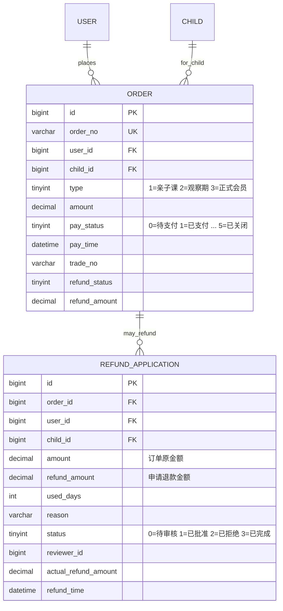
```mermaid
erDiagram
    ORDER {
        bigint id PK
        varchar order_no UK
        bigint user_id FK
        bigint child_id FK
        tinyint type "1=亲子课 2=观察期 3=正式会员"
        decimal amount
        tinyint pay_status "0=待支付 1=已支付 ... 5=已关闭"
        datetime pay_time
        varchar trade_no
        tinyint refund_status
        decimal refund_amount
    }

    REFUND_APPLICATION {
        bigint id PK
        bigint order_id FK
        bigint user_id FK
        bigint child_id FK
        decimal amount "订单原金额"
        decimal refund_amount "申请退款金额"
        int used_days
        varchar reason
        tinyint status "0=待审核 1=已批准 2=已拒绝 3=已完成"
        bigint reviewer_id
        decimal actual_refund_amount
        datetime refund_time
    }

    USER ||--o{ ORDER : "places"
    CHILD ||--o{ ORDER : "for_child"
    ORDER ||--o{ REFUND_APPLICATION : "may_refund"
```

### 2.11 活动模块

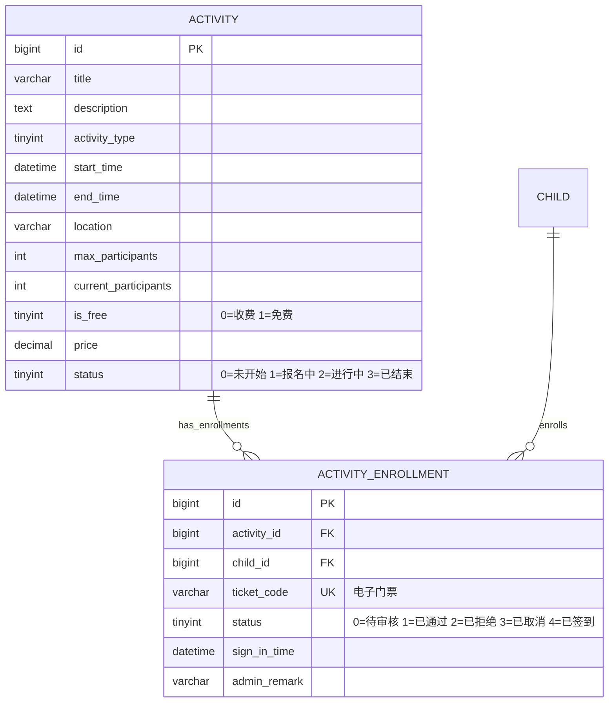
```mermaid
erDiagram
    ACTIVITY {
        bigint id PK
        varchar title
        text description
        tinyint activity_type
        datetime start_time
        datetime end_time
        varchar location
        int max_participants
        int current_participants
        tinyint is_free "0=收费 1=免费"
        decimal price
        tinyint status "0=未开始 1=报名中 2=进行中 3=已结束"
    }

    ACTIVITY_ENROLLMENT {
        bigint id PK
        bigint activity_id FK
        bigint child_id FK
        varchar ticket_code UK "电子门票"
        tinyint status "0=待审核 1=已通过 2=已拒绝 3=已取消 4=已签到"
        datetime sign_in_time
        varchar admin_remark
    }

    ACTIVITY ||--o{ ACTIVITY_ENROLLMENT : "has_enrollments"
    CHILD ||--o{ ACTIVITY_ENROLLMENT : "enrolls"
```

### 2.12 报告与系统模块

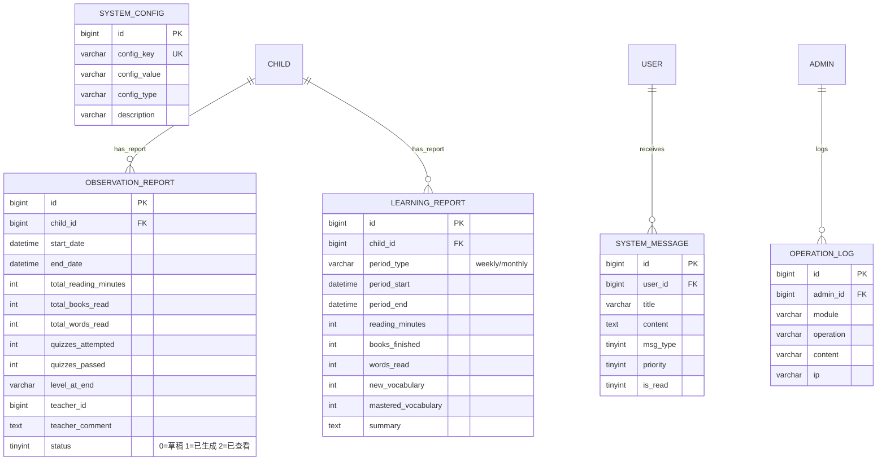
```mermaid
erDiagram
    OBSERVATION_REPORT {
        bigint id PK
        bigint child_id FK
        datetime start_date
        datetime end_date
        int total_reading_minutes
        int total_books_read
        int total_words_read
        int quizzes_attempted
        int quizzes_passed
        varchar level_at_end
        bigint teacher_id
        text teacher_comment
        tinyint status "0=草稿 1=已生成 2=已查看"
    }

    LEARNING_REPORT {
        bigint id PK
        bigint child_id FK
        varchar period_type "weekly/monthly"
        datetime period_start
        datetime period_end
        int reading_minutes
        int books_finished
        int words_read
        int new_vocabulary
        int mastered_vocabulary
        text summary
    }

    SYSTEM_CONFIG {
        bigint id PK
        varchar config_key UK
        varchar config_value
        varchar config_type
        varchar description
    }

    SYSTEM_MESSAGE {
        bigint id PK
        bigint user_id FK
        varchar title
        text content
        tinyint msg_type
        tinyint priority
        tinyint is_read
    }

    OPERATION_LOG {
        bigint id PK
        bigint admin_id FK
        varchar module
        varchar operation
        varchar content
        varchar ip
    }

    CHILD ||--o{ OBSERVATION_REPORT : "has_report"
    CHILD ||--o{ LEARNING_REPORT : "has_report"
    USER ||--o{ SYSTEM_MESSAGE : "receives"
    ADMIN ||--o{ OPERATION_LOG : "logs"
```

### 2.13 观察期评估模块 ★ V3.1

```mermaid
erDiagram
    OBSERVATION_EVALUATION {
        bigint id PK
        bigint child_id FK
        bigint teacher_id
        smallint reading_interest "1-5"
        smallint reading_speed "1-5"
        smallint comprehension "1-5"
        smallint independent_reading "1-5"
        int total_score "四项之和"
        smallint result "1=通过 2=待定 3=未通过"
        text remark
        datetime evaluation_date
    }

    CHILD ||--o{ OBSERVATION_EVALUATION : "evaluated_in"
```

### 2.14 亲子课时间段模块 ★ V3.1

```mermaid
erDiagram
    PARENT_COURSE_TIME {
        bigint id PK
        bigint venue_id FK
        varchar course_date "YYYY-MM-DD"
        varchar start_time "HH:MM"
        varchar end_time "HH:MM"
        int max_participants "默认10"
        int current_participants "默认0"
        smallint status "1=可预约 0=已满 -1=已关闭"
    }

    VENUE ||--o{ PARENT_COURSE_TIME : "hosts"
```

### 2.15 配置审计模块 ★ V3.1

```mermaid
erDiagram
    CONFIG_AUDIT_LOG {
        bigint id PK
        varchar config_key "索引"
        text old_value
        text new_value
        bigint changed_by
    }
```

### 2.16 死信事件模块 ★ V3.1

```mermaid
erDiagram
    DEAD_LETTER_EVENT {
        bigint id PK
        varchar event_type "索引"
        text event_data "JSON"
        varchar handler_name
        text error_message
        smallint retry_count "默认0"
        varchar resolved_at
    }
```

### 2.17 图书页内容模块 ★ V3.1

```mermaid
erDiagram
    BOOK_PAGE {
        bigint id PK
        bigint book_id FK
        int page_number
        smallint content_type "0=文本 1=图片 2=混合"
        text text_content
        varchar image_url
        varchar audio_url
        int audio_duration "秒"
    }

    BOOK ||--o{ BOOK_PAGE : "has_pages"
```

---

## 三、V3.1 模块关系总览

```mermaid
graph TD
    USER[用户] --> CHILD[孩子]
    TEACHER[老师] --> BOOK[图书管理]
    TEACHER --> QUIZ_MANAGE[题库管理]
    TEACHER --> BORROW_MANAGE[借还管理]

    BOOK --> BOOK_COPY[实体副本]
    BOOK --> BOOKSHELF[想读清单]
    BOOK --> FAVORITES[收藏夹]
    BOOK --> QUESTION_BANK[题库]
    BOOK --> RESERVATION[预约]

    CHILD --> BOOKSHELF
    CHILD --> FAVORITES
    CHILD --> BORROW_RECORD[借阅记录]
    CHILD --> DEPOSIT_RECORD[押金记录]
    CHILD --> RESERVATION

    BOOK_COPY --> BORROW_RECORD
    RESERVATION --> BORROW_RECORD

    BOOKSHELF --> READING[阅读进度]
    READING --> SUBMISSION[读完提交]
    SUBMISSION --> QUIZ[测验]
    QUIZ --> SCORE[积分]

    SCORE --> ADVANCEMENT[晋级A→Z]
    ADVANCEMENT --> CERTIFICATE[证书]
    ADVANCEMENT --> BADGE[成就]

    CHILD --> CHECKIN[打卡]
    CHILD --> VOCABULARY[生词本]
    CHILD --> STATS[统计报告]

    CHILD --> ORDER[订单]
    ORDER --> PAYMENT[微信支付]
    PAYMENT --> MEMBERSHIP[会员]

    CHILD --> ACTIVITY[活动]
    ACTIVITY --> ENROLLMENT[报名]
```

---

## 已删除的表

| 表 | 版本 | 原因 |
|---|------|------|
| collection（馆藏） | V2.0 | 线下馆藏功能恢复后改用 book_copy |

> **V3.1 重新引入的表**：`borrow_record`、`reservation`、`deposit_record` 在 V3.1 中以新结构回归。
> **V3.1 新增的表**：`observation_evaluation`、`parent_course_time`、`config_audit_log`、`dead_letter_event`、`book_page`。
